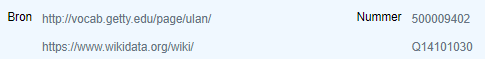

# 2. ADLIB: PERSONEN EN INSTELLINGEN

## Identificatie

### Naam

Wordt automatisch gegenereerd op basis van ingevulde naamdetails \(bij personen\). Voor instelling hier zelf de instellingsnaam invullen

### Soort naam

'persoon' of 'instelling' \(+ eventuele bijkomende\)

### Referentienummer

ON HOLD

### Opmerking naam

### Naamdetails

Tenminste achternaam en voornaam \(indien gekend\) invullen

### Status

'descriptor'

### Bronnen en andere informatie over het record

Linken aan externe autoriteit 

Bron

* ULAN: https:/rkd.nl/explore/artists/
* Wikidata: https://www.wikidata.org/wiki/
* RKD: http://vocab.getty.edu/page/ulan/

 

> screenshot

## Biografische persoonsgegevens

### Geboortegegevens

#### Datum \(begin\)

#### Datum \(einde\)

#### Precisie

#### Plaats

### Overlijdensgegevens

#### Datum \(begin\)

#### Datum \(einde\)

#### Precisie

#### Plaats

### Herkomst

### Vakgebied

#### Beroep

#### School/stijl

### Plaats van werkzaamheid

#### Plaats

#### Begindatum

#### Einddatum

#### Instituut

#### Bijzonderheden

### Andere informatie

#### Biografie

#### Structuur/genealogie

#### Algemene context

### Adresgegevens

### Relaties

#### Is deel van

#### Heeft als deel

#### Andere relatie

#### categorie

#### begindatum

#### einddatum

#### bijzonderheden

