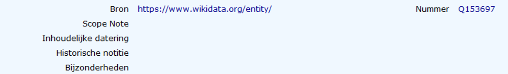

# Thesaurus



### Term

### Soort term

### Status

Termen die de status 'descriptor' hebben, zijn gecontroleerd, gelinkt aan een externe autoriteit en worden gebruikt binnen het project Collectie van de Gentenaar. 



### Use

### Used for

### Broader Term

### Narrower Term

### Related Term

### Equivalent Term



### Bron & Nummer

Linken aan externe autoriteit 

Bron

* AAT: [http://vocab.getty.edu/aat/](http://vocab.getty.edu/aat/)
* Wikidata: [https://www.wikidata.org/entity/](https://www.wikidata.org/entity/)
* TGN: [http://vocab.getty.edu/tgn/](http://vocab.getty.edu/tgn/)
* Onroerend Erfgoed Gebouwen: [https://id.erfgoed.net/erfgoedobjecten/](https://id.erfgoed.net/erfgoedobjecten/)
* Onroerend Erfgoed Straten: [https://id.erfgoed.net/themas/](https://id.erfgoed.net/themas/)

### Scope note

### Bijzonderheden



### 

### 

